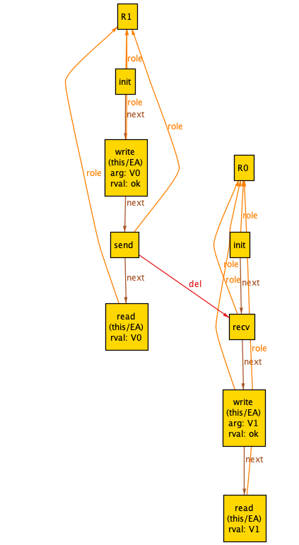
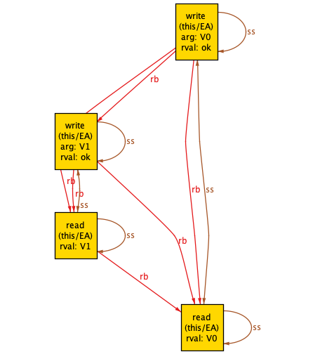
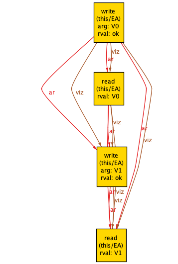

# Beating the CAP theorem: the epidemic register

*Note: This is currently a work in progress.*

The CAP theorem states that distributed data structures cannot have
all three of the following properties:

* consistency
* availability
* partition tolerance


Alas, there's no way to beat the CAP theorem for *linearizable* consistency. However, what about 
the weaker (but still strong) *sequential consistency*? 
Well, you still can't beat the CAP theorem in the general case. 

However, if you're willing to settle for sequential consistency, it turns out
that there is a data structure that has all three properties: the *epidemic
register*.

This post uses that register as an example to explain the CAP theorem, as
well as illustrate how to do some formal specifying use TLA+ and Alloy.

Much of this post comes directly from Sebastian Burckhardt's excellent (free!) book 
[Principles of Eventual Consistency][PoEC]. I'm just going to call it [PoEC] from.

# What's a register?

A register is a data structure that supports two operation:

* write value
* read value

A register behaves like a variable in a programming language. It's
such a simple data structure, that you may have not even heard
of it unless you've studied computer architecture or distributed systems.

Computer architects care about registers because CPUs have registers
inside them: you load data from memory into registers, and then
the instructions operate on the data inside of the registers.

Distributed systems researchers care about registers because, even though
they are such a simple data structure, even the simplest data structure
is very complex when implemented in a distributed system!


# What does the CAP theorem really mean?

We need a formal definition of the CAP theorem.

## Consistency

Sequential consistency.

Similar to serializability for transactions.

Note that this is weaker than linearizability.

## Availability

Operations can't block

## Partition tolerance

An arbitrary amount of messages may be lost

# What is an epidemic register?

Here's an implementation of an epidemic register from Burckhardt's [Principles
of Eventual Consistency][PoEC] (Fig 1.2, p14), in pseudocode:

```
protocol EpidemicRegister {

  struct Timestamp(number: nat; pid: nat) ;
  function lessthan(Timestamp(n1,pid1), Timestamp(n2,pid2)) {
    return (n1 < n2) ∨ (n1 == n2 ∧ pid1 < pid2) ;
}

  message Latest(val: Value, t: Timestamp) : dontforge, eventualindirect

  role Peer(pid: { 0 .. N }) {

    var current: Value := undef ;
    var written: Timestamp := Timestamp(0,pid) ;

    operation read() {
      return current;
    }
    operation write(val: Value) {
      current := val ;
      written := Timestamp(written.number + 1,pid) ;
      return ok ;
    }

  periodically {
    send Latest(current, written) ;
  }

  receive Latest(val,ts) {
    if (written.lessthan(ts)) {
      current := val ;
      written := ts;
      }
    }
  }
}

```

# TLA+

See [epidemic.tla](epidemic.tla) for the TLA+/PlusCal model. The model contains some extra variables
that aren't needed to model the register but are needed to show that the register is sequentially consequent.

There's a refinement that shows that this implementation is a sequentially consistent implementation
of the spec [register.tla](register.tla). 

# Alloy

The Alloy model is pretty much a direct implementation of the event graph scheme outlined in [PoEC].

The file [concrete.als](concrete.als) contains models about concrete executions that aren't specific
to any implementation.

The file [epidemic.als](epidemic.als) contains the implementation of the epidemic register, using
the models defined in concrete.als.

## Not linearizable: a counterexample

To generate a counterexample that shows a history that isn't linearizable, see the epidemic.als file.
I'm going to use terminology from [PoEC]:

* concrete execution
* history
* abstract execution


### Concrete exeuction

Here's a *concrete execution*, displayed using the [concrete-theme.thm](concrete-theme.thm) theme file:



There are two roles, denoted R0 and R1. You can think of a role as a server.

### History

Here's a history graph that corresponds to this concrete execution. I generated by loading the [history-theme.thm](history-theme.thm) file.

A history elides a lot of details from the concrete execution: it just shows returns-before (*rb*) and same-session (*ss*)
relations. 



Note how the `w(V1)` operation returns before the `r(V0)` operation.


### Abstract execution

Here's an *abstract execution*, which is the same graph with the [abstract-theme.thm](abstract-theme.thm) theme file loaded. Note that I'm only showing arbitration (*ar*) and
visualization (*viz*) relations. And, in this case, they're identical, so I don't really
need to show them both.



The relations create a total ordering, which I've shown from top to bottom. Here's how the abstract
execution has sequenced the operations:

```
w(V0)
r(V0)
w(V1)
r(V1)
```

That's a valid sequential history for a register! But it has sequenced `w(V1)` after `r(V0)`, and we
know from the concrete execution and the history that the `r(v0)` actually happened before `w(v1)`.

This demonstreates how a sequentially consistent history is not necessarily linearizable.


[PoEC]: https://www.microsoft.com/en-us/research/publication/principles-of-eventual-consistency/
