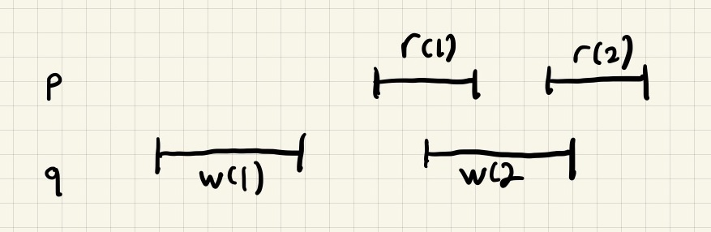
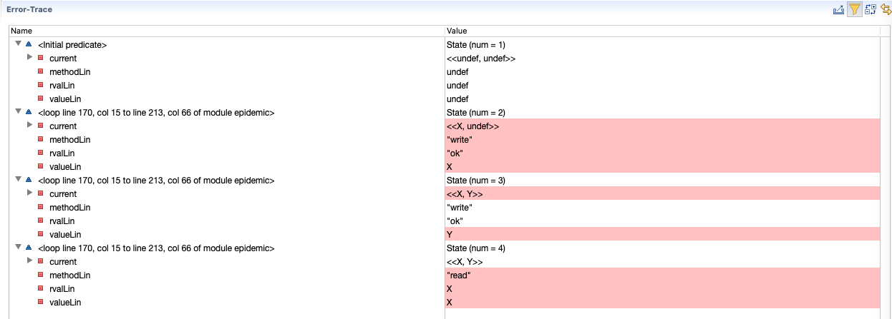

# Beating the CAP theorem: the epidemic register
## Or: fun with TLA+ and Alloy

*Note: This is a work in progress.*

The CAP theorem, originally conjectured by Eric Brewer, claims that distributed data structures cannot have
all three of the following properties:

* Consistency
* Availability
* Partition tolerance

## You can't beat the CAP theorem! Gilbert and Lynch proved it

It's true. There's no way to beat the CAP theorem if your system needs *linearizable* consistency. Gilbert
and Lynch proved that it's impossible to have all three properties.

There is a consistency model that, while weaker than linearizability, is still considered a strong model: *sequential
consistency*.

## You still can't beat the CAP theorem with sequential consistency!

Alas, switching to sequential consistency can't save us from the CAP theorem
in the general case. Here's what [Jepsen has to say about sequential consistency and availability](http://jepsen.io/consistency/models/sequential):

> Sequential consistency cannot be totally or sticky available; in the event of a network partition, some or all nodes will be unable to make progress.

However, it turns out that there is a simple distributed data structure called an *epidemic register* which is sequentially
consistent, available, and partition tolerant!

This repository uses the *epidemic register* as a pedagogical example to cover different concepts in distributed systems theory and
lightweight formal methods:

* registers (regular, atomic)
* epidemic protocols
* CAP theorem
* consistency models
* TLA+ formal modeling language (including PlusCal and refinement mapping)
* Alloy formal modeling language

This doc uses that register as an example to explain the CAP theorem, as
well as illustrate how to do some formal specifying use TLA+ and Alloy.

Much of this doc comes directly from Sebastian Burckhardt's excellent (free!) book 
[Principles of Eventual Consistency][PoEC]. I'm just going to call it [PoEC] from here on out.

# What's a register?

A register is a data structure that supports two operations:

* write a value
* read a value

A register behaves like a variable in a programming language. It's
such a simple data structure that you may not have even heard
of it unless you've studied computer architecture or distributed systems.

Computer architects care about registers because CPUs have registers
inside them: you load data from memory into registers, and then
the instructions operate on the data inside of the registers.

Distributed systems researchers care about registers because, even though
they are such a simple data structures, even the simplest data structure
is very complex when implemented in a distributed system!

I'm going to use `w(x)` to mean "value x was written to the register" and `r(x)`
to mean "value x was read from the register. For example, to indicate
"the value 2 was written to the register and then the value 2 from read from
the register" like this:

```
w(2)
r(2)
```

# What does *epidemic* mean?

The term *epidemic protocol* is a synonym for *gossip protocol*. It refers
to a mechanism of implementing a message broadcast where the message propagates
through a network over time, via peer-to-peer communication.

Epidemic protocols are one way of building systems that remain available
under partitions. As we'll see in the implementation of the epidemic register,
reads and writes can complete without having to wait for messages to be exchanged.
This is different from quorum-based protocols where an operation will block waiting
for a quorum of nodes to respond to requests.

# Consistency models

Before we get to the CAP theorem, we're going to talk about a few different kinds
of consistency models, using different types of registers and an example.

## Why care about consistency models?


## Regular register

In his paper "On Interprocess Communication" Lamport defines a *regular register* as a register where:

* a read not concurrent with a write gets the correct value
* a read that overlaps a write obtains either the old or new value

Here's an example of a valid history for a regular register.

This history shows two processes, denoted *p* and *q*. The second write of *q*, `w(2)` overlaps
with two of the reads of *p*, `r(1)` and `r(2)`.




## Atomic register

TBD


# What does the CAP theorem really mean?

We need a formal definition of the CAP theorem.

## Consistency

Sequential consistency.

Similar to serializability for transactions.

Note that this is weaker than linearizability.

## Availability

Operations can't block

## Partition tolerance

An arbitrary amount of messages may be lost

# What is an epidemic register?

Here's an implementation of an epidemic register from Burckhardt's [Principles
of Eventual Consistency][PoEC] (Fig 1.2, p14), in pseudocode:

```
protocol EpidemicRegister {

  struct Timestamp(number: nat; pid: nat) ;
  function lessthan(Timestamp(n1,pid1), Timestamp(n2,pid2)) {
    return (n1 < n2) ∨ (n1 == n2 ∧ pid1 < pid2) ;
}

  message Latest(val: Value, t: Timestamp) : dontforge, eventualindirect

  role Peer(pid: { 0 .. N }) {

    var current: Value := undef ;
    var written: Timestamp := Timestamp(0,pid) ;

    operation read() {
      return current;
    }
    operation write(val: Value) {
      current := val ;
      written := Timestamp(written.number + 1,pid) ;
      return ok ;
    }

  periodically {
    send Latest(current, written) ;
  }

  receive Latest(val,ts) {
    if (written.lessthan(ts)) {
      current := val ;
      written := ts;
      }
    }
  }
}

```

# TLA+

See [epidemic.tla](epidemic.tla) for the TLA+/PlusCal model. The model contains some extra variables
that aren't needed to model the register but are needed to show that the register is sequentially consistent.

There's a refinement that shows that this implementation is a sequentially consistent implementation
of the spec [register.tla](register.tla). 

There are actually two refinement mappings in the model, one for a sequentially consistent register (RegSeq),
and one for a linearizable regiser (RegLin).

## Not linearizable, a counterexample

Alas, the epidemic register isn't linearizable. But that means we can use TLC to find a counter-example.

The property I checked was `RegLin!Spec`. The parameters in the model were:

```
Temporal formula: Spec

Declared constants:
N <- 2
Steps <- 4
Values <- [ model value ] {X, Y}

Definition overrides:
undef <- [ model value ]
NIL [register] <- undef
```



Here's the history from that error trace, which clearly violates the specification for a register.

```
w(X)
w(Y)
r(X)
```


# Alloy

The Alloy model is pretty much a direct implementation of the event graph scheme outlined in [PoEC].

The file [concrete.als](concrete.als) contains models about concrete executions that aren't specific
to any implementation.

The file [epidemic.als](epidemic.als) contains the implementation of the epidemic register, using
the models defined in concrete.als.

## Not linearizable: a counterexample

To generate a counterexample that shows a history that isn't linearizable, see the epidemic.als file.
I'm going to use terminology from [PoEC]:

* concrete execution
* history
* abstract execution


### Concrete execution

Here's a *concrete execution*, displayed using the [concrete-theme.thm](concrete-theme.thm) theme file:


There are two roles, denoted R0 and R1. You can think of a role as a server.

### History

Here's a history graph that corresponds to this concrete execution. I generated it by loading the [history-theme.thm](history-theme.thm) file.

A history elides a lot of details from the concrete execution: it just shows returns-before (*rb*) and same-session (*ss*)
relations. 


Note how the `w(V1)` operation returns before the `r(V0)` operation.


### Abstract execution

Here's an *abstract execution*, which is the same graph with the [abstract-theme.thm](abstract-theme.thm) theme file loaded. Note that I'm only showing arbitration (*ar*) and
visualization (*viz*) relations. And, in this case, they're identical, so I don't really
need to show them both.


The relations create a total ordering, which I've shown from top to bottom. Here's how the abstract
execution has sequenced the operations:

```
w(V0)
r(V0)
w(V1)
r(V1)
```

That's a valid sequential history for a register! But it has sequenced `w(V1)` after `r(V0)`, and we
know from the concrete execution and the history that the `r(v0)` actually happened before `w(v1)`.

This demonstreates how a sequentially consistent history is not necessarily linearizable.


[PoEC]: https://www.microsoft.com/en-us/research/publication/principles-of-eventual-consistency/


# References

## Sesbastian Burckhardt. Principles of Eventual Consistency, 2014

<https://www.microsoft.com/en-us/research/publication/principles-of-eventual-consistency/>

Burckhardt's book is the primary source material for this work.


## Seth Gilbert and Nancy Lynch. Brewer’s Conjecture and the Feasibility of Consistent, Available, Partition-Tolerant Web Services, ACM SIGACT News, 2002

<https://www.comp.nus.edu.sg/~gilbert/pubs/BrewersConjecture-SigAct.pdf>

Eric Brewer originally conjectured the CAP Theorem, but it was this paper by Gilbert and Lynch that proved it. Note that the
proof assumes *linearizable* consistency.

## Maurice P. Herlihy and Jeannette M. Wing. Linearizability: A Correctness Condition for Concurrent Objects. ACM Transactions on Programming Languages and Systems, Vol. 12, No. 3, July 1990

<http://cs.brown.edu/~mph/HerlihyW90/p463-herlihy.pdf>

Herlihy and Wing introduces the concept of *linearizability* in this paper.


## Leslie Lamport. How to Make a Multiprocessor Computer That Correctly Executes Multiprocess Programs. IEEE Transactions on Computers C-28  Vol 9,September 1979

<https://www.microsoft.com/en-us/research/publication/make-multiprocessor-computer-correctly-executes-multiprocess-programs/>

Lamport introduces the concept of *sequential consistency* in this paper.

## Leslie Lamport. On Interprocess Communication--Part I: Basic Formalism, Distributed Computing, Vol. 1, No. 2, 1986.

<http://lamport.azurewebsites.net/pubs/interprocess.pdf>

Lamport introduces the concepts of a *regular register* and an *atomic register* in this paper.
